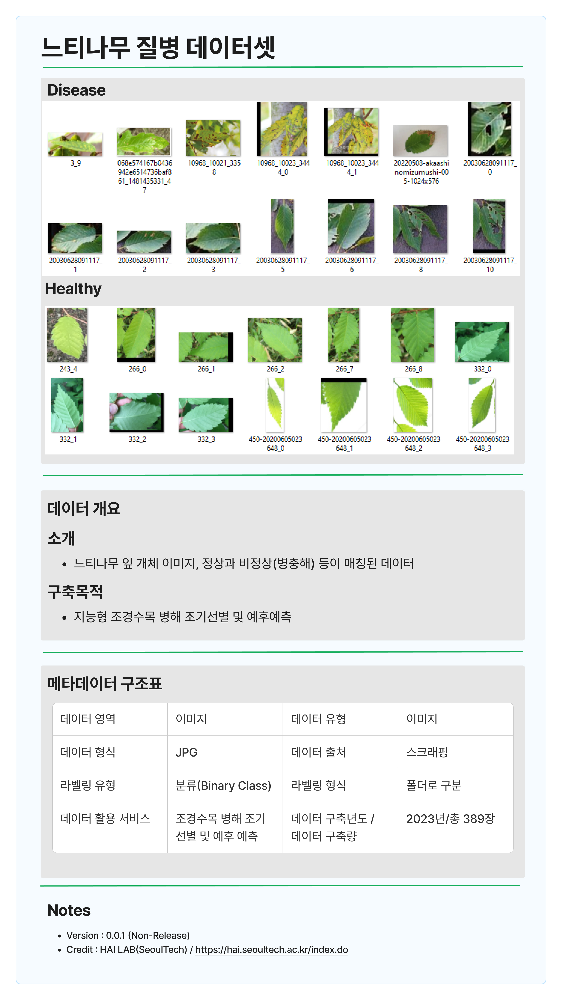

# 2023년 2학기 딥러닝 기말 프로젝트
## ! 데이터셋은 리포지토리에 포함되지 않음 !
데이터는 eclass 공지사항에서 별도로 다운로드, train과 test 모두 data 디렉토리에 복사하여 주세요\
(data/train, data/test가 되도록 구성)\
\
데이터셋은 서경원 교수님 연구실에서 라벨링한 것이므로,\
해당 리포지토리에서는 데이터에 대한 간략한 설명 이미지만을 포함합니다.

## Introduction
### 왜 나무 질병에 대해 연구해야하는가?

1. 조기 진단 및 모니터링

   인공지능을 활용한 IoT 조경수목은 병해를 조기에 선별하고 예후를 예측하여 조기진단 및 모니터링이 가능합니다.

2. 생태계 보전

   나무 질병의 조기 발견으로 인해 전염을 예방하고 퍼지는 것을 방지함으로써 산림 생태계를 보존하는 데 도움이 됩니다.

3. 임업사업 지원

   임업 산업에 적용되어 나무 생산성을 향상시키고 임산물 품질을 개선할 수 있습니다.

   예를 들어, 병해충이나 질병에 감염된 나무를 식별하여 신속하게 처리함으로써 수확량을 최적화할 수 있습니다.

## 추가 데이터셋 사용 - PlantVillage
transfer learning 과정에 PlantVillage 데이터셋을 추가로 사용하여 \
모델을 2차례에 걸쳐 학습을 진행하였습니다.\
PlantVillage 데이터셋 또한 리포지토리에 포함되지 않으며\
아래 캐글 주소에서 별도로 다운받을 수 있습니다.\
https://www.kaggle.com/datasets/emmarex/plantdisease
\
PlantVillage 데이터셋은 다운받으신 후 압축을 해제하여\
PlantVillage 폴더를 data 폴더에 위치시켜주시면 됩니다.

## TODO
### data_processing.py
collate_fn 만들기 ✔\
data size가 균일하지 않으므로, 이를 위한 collate_fn 필요 ✔\
padding or crop or stretch -> 아마 padding 아니면 stretch 사용 ✔\
-> Lanzcos 보간법 이용하여 resize 후 패딩하는 방식 사용

K fold crossvalidation 구현 ✔\
-> https://stackoverflow.com/questions/60883696/k-fold-cross-validation-using-dataloaders-in-pytorch 참고하기\

data transform(data augmentation) 적용 ✔

### model.py
모델 구현 -> resnet 사용 ✔

### FINAL
모델 학습 및 성능 평가 ✔\
confusion matrix 구현 ✔\
data augmentation \
-> 시간이많다면 randaugment를 grid search해보기(lr_rate를 늘리고, 에포크 수 줄여서) \
-> MixUp 구현 \

Transfer Learning ✔\
Imagenet-21k model finetuning ✔\
Imagenet-21k model -> plantvillage fintuning -> our dataset fintuning ✔
